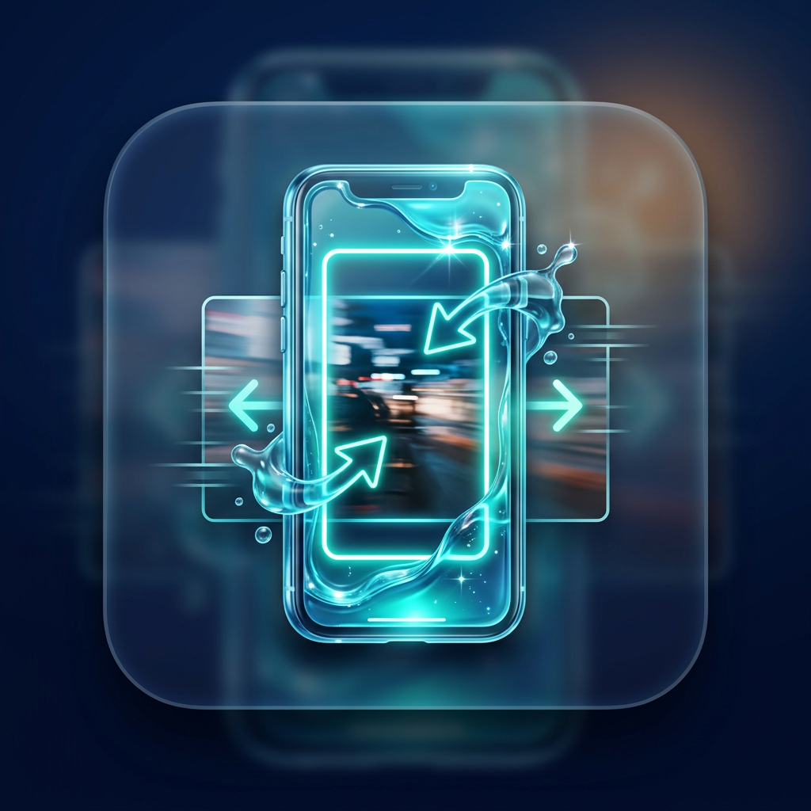

# Reel Cropper 9:16

**Simple macOS app to crop your 16:9 videos to perfect 9:16 Instagram Reels.** Select folder → click → done. Powered by FFmpeg.



## ✨ Features

- Converts 16:9 → 9:16 with **center crop** (keeps action in frame)
- **Batch processes** all `.mp4` and `.mov` files in selected folder
- **Folder picker UI** (no drag&drop needed)
- High quality H.264 output (CRF 23, visually lossless)
- Creates `cropped_9x16/` folder automatically
- Progress visible during processing

## 🚀 Quick Start

```bash
# 1. Install FFmpeg (one time)
brew install ffmpeg

# 2. Download ReelCropper.app.zip from Releases
# 3. Unzip → double-click app
# 4. Select your videos folder → wait → find results!
